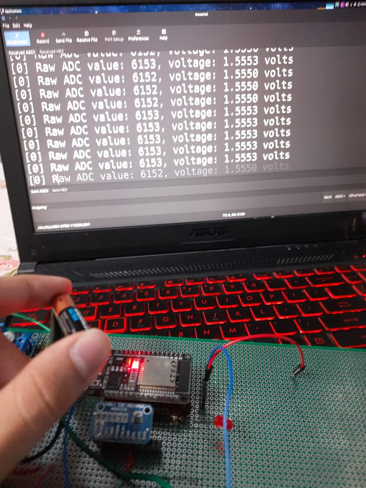

# ESP32-ADS1115
This repo in detail shows how to make a voltmeter using unclerus ADS111X library in ESP IDF



## Steps: 
1. clone the library to your ~/esp/. 
``` cd ~/esp/
git clone https://github.com/UncleRus/esp-idf-lib.git  
```

2. Clone this repo. 
3. Make connections as shown:

| S. No. | ADS 1115 | ESP 32            |
|--------|----------|-------------------|
| 1.     | V_DD     | V_in or 5V source |
| 2.     | GND      | GND               |
| 3.     | SCL      | D22               |
| 4.     | SDA      | D21               |

And, Your analog input in A0

No other pins need any connections in my experience uptil now.
Hope this helps anyone facing these issues, as this is the only thread I found after googling for solutions
